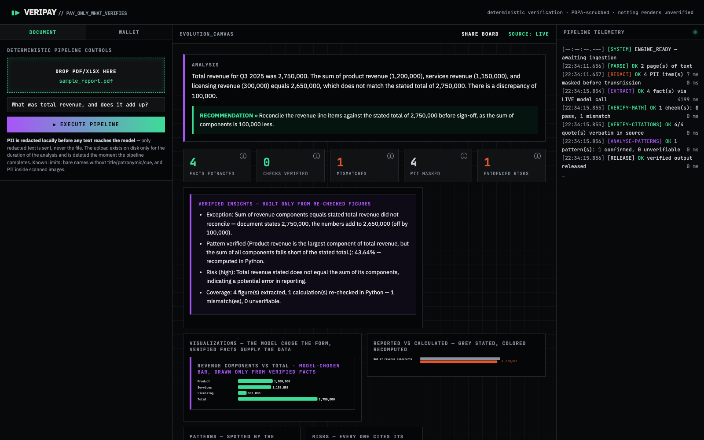
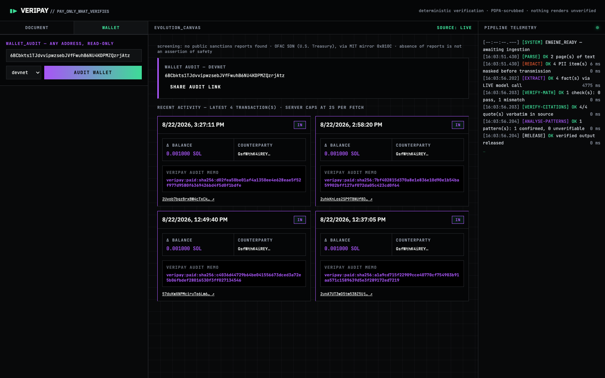
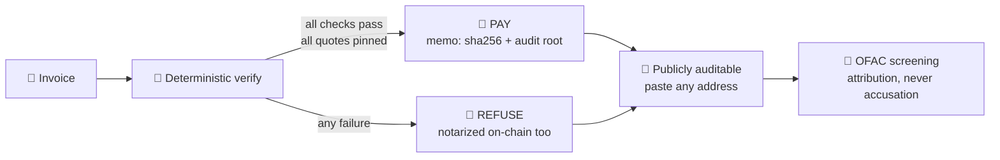

# VeriPay

**Verification-gated agentic payments on Solana.** An AI agent reads an
invoice (PDF/XLSX), a deterministic engine verifies every claim — the
arithmetic recomputed in Python, every number pinned to a verbatim source
quote — and only a fully verified invoice gets paid. A failed check, an
unpinned quote, or a cached fallback result refuses payment, loudly.

DevLeague **Superteam Lab** entry. Primary focus area: **AI & Agentic
Commerce** — agents that transact and pay on their own, with the missing
ingredient supplied: a reason to trust the numbers they act on.

Secondary mappings (until full problem statements are revealed):
- *Payments for SEA* — the same gate in front of low-cost regional transfers.
- *Customer Experience* — the human never signs blind: the explorer link
  proves what was verified before value moved.
- *Sustainability/ESG* — same engine pointed at ESG disclosures; anchored
  digests make restatements detectable. (Weakest fit; not the pitch.)

## Live viewer 🌐

**https://veripay.nazrijz336.workers.dev** — Cloudflare Workers static
viewer: shared boards open anywhere. The engine + chain layer run on the
analyst's machine (Workers can't load solders, and shouldn't hold keys).

## Screenshots


*Live pipeline: mismatch caught, trend verified, evidenced risks, 6/6 quotes pinned.*


*Paste-any-address ledger 📒: every agent payment decoded off public RPC,
OFAC screening with honest wording, fetch cap stated. Scales past 100 tx
by wrapping, not horizontal scrolling.*

## How the agent decides 💸




## Lineage

The verification engine is [FinVerify](https://github.com/ponli550/DevLeague)
(DevLeague Lab 1): parse → PDPA redaction → DeepSeek strict-JSON extraction
→ deterministic checks (no eval) → verbatim-quote citation check → CI-style
release gate. This repo adds `chain.py`: sha256 notarization of the released
result via the Memo program, and `pay_if_verified()` — the product thesis in
one function.

## Run

```bash
uv sync
cp .env.example .env    # DeepSeek key + a devnet keypair (see below)
uv run python make_sample.py
uv run python test_backend.py   # offline, zero API cost
uv run python server.py         # engine UI (chain wiring lands after the
                                # full problem statements are revealed)
```

Devnet setup (manual, BEFORE the venue — public faucets rate-limit):

```bash
uv run python -c "from solders.keypair import Keypair; k=Keypair(); print('pubkey:', k.pubkey()); print('secret:', k)"
# put the secret in .env as SOLANA_SECRET_KEY, then fund the pubkey at faucet.solana.com
```

## Honesty rules (inherited, test-enforced)

No eval. No fabricated output. A cached fallback flags itself and is
**never paid**. Chain tests run offline against an injected fake RPC
transport; the live devnet path is exercised manually, and a notarization
failure renders as a failure — never a placeholder signature.

## Demo deployment (Cloudflare quick tunnel)

```bash
bash scripts/tunnel.sh   # prints an ephemeral public URL; QR/share links use it automatically
```

Security: while the tunnel is up, the analyze endpoint is publicly
reachable (unguessable URL, no auth) — run it for the demo window only
and kill it immediately after. The URL changes every start, by design.
